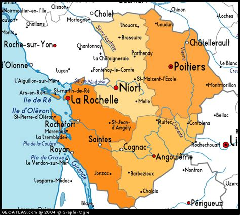
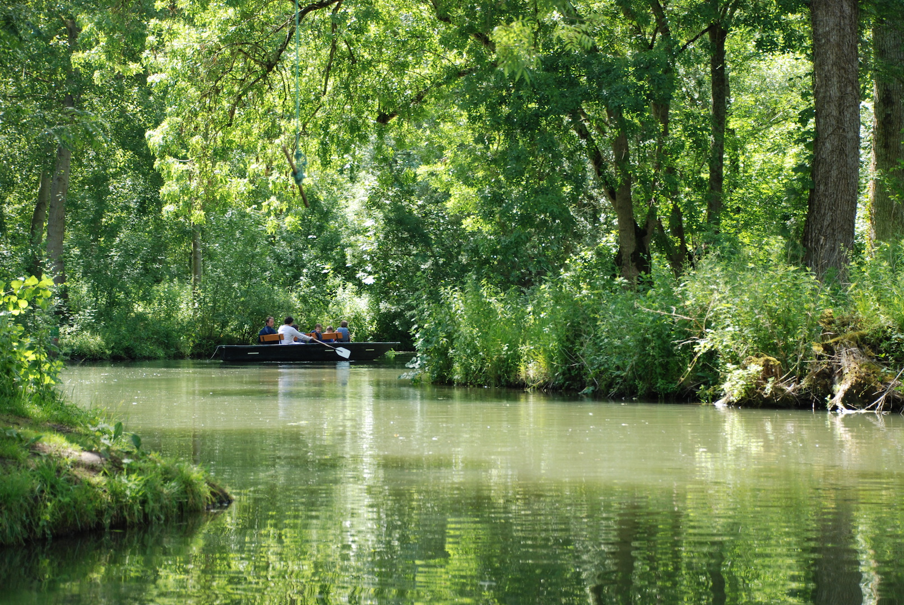
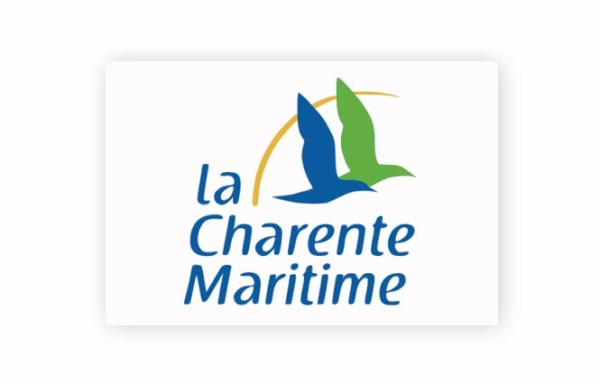

# La Charente-Maritime

Ici, venez découvrir le département de la Charente-Maritime dans lequel se trouve La Rochelle.

La **Charente-Maritime**, un département situé dans le sud-ouest de la France, sur la façade atlantique. C’est un territoire riche à la fois par sa nature, son patrimoine historique, sa culture et son dynamisme économique.

---

### 📍 Présentation générale

<u>Nom:</u> Charente-Maritime

<u>Numéro:</u> 17

<u>Région:</u> Nouvelle-Aquitaine

<u>Préfecture:</u> La Rochelle

S<u>ous-préfectures:</u> Rochefort, Saintes, Jonzac, Saint-Jean-d'Angély

<u>Superficie:</u> Environ 6 864 km²

<u>Population:</u> Environ 660 000 habitants (en 2023)

---

### 🌊 Géographie et environnement

Le littoral Atlantique représente plus de 460 km de côtes avec des plages réputées et un climat doux de type océanique.

**les îles emblématiques:**

*Île de Ré* : chic et très touristique, accessible par un pont.

*Île d’Oléron* : plus sauvage et vaste, célèbre pour ses huîtres.

*Île d’Aix et Île Madame* : plus petites, préservées et accessibles selon les marées.

**L'Estuaire de la Gironde:** frontière naturelle avec la Gironde, riche en biodiversité.

**Le Marais poitevin** (partie orientale du département) est une zone humide remarquable surnommée la "Venise verte".

### 🏛️ Patrimoine historique et culturel

**La Rochelle** : port historique, ancien bastion protestant, architecture remarquable (tours médiévales, vieux port).

**Saintes** : ville gallo-romaine, célèbre pour son amphithéâtre et ses vestiges antiques.

**Rochefort** : ancienne base navale, abrite l’arsenal et la Corderie Royale.

**Abbaye de Trizay**, **abbaye aux Dames** à Saintes, châteaux (La Roche-Courbon, Panloy, etc.).

---

### 🦪 Gastronomie locale
**Huîtres de Marennes-Oléron** : les plus célèbres de France.

**Pineau des Charentes et cognac** : le département fait partie de la zone d’appellation.

Mouclade, éclade de moules, mojettes, charentais melon.

Produits locaux : **sel de l’île de Ré**, **vin de pays charentais**, fromages de chèvre.

---

### 🚴‍♂️ Tourisme et activités

|Catégories| Activités|
|:-----|:----|
|Cyclotourisme|  pistes cyclables nombreuses: Vélodyssée et la Flow Vélo|
|Stations balnéaires| Royan ; Chatelaillon-Plage; Fouras ...|
|Thermalisme| Jonzac (station thermale)|
|Réserves naturelles|  Moëze-Oléron, Marais d’Yves...|
|Nautisme| Bâteau ;jet ski; voile; surf kayak...|

---

### 🚉 Accès et transports

**Train** : TGV depuis Paris (2h30 pour La Rochelle), liaisons TER vers Angoulême, Bordeaux, Nantes…

**Route** : A10, RN11, RN137…

**Aéroport de La Rochelle-Île de Ré** : vols nationaux et internationaux saisonniers.

**Ferries** et **navettes maritimes** entre îles et continent.

---

Voici le lien pour retourner vers [la page d'acceuil](index.md). Tu pourras te diriger vers d'autres pages qui te donneront des informations sur la ville de [La Rochelle](ma-ville.md) et sur la région [Nouvellle-Aquitaine](ma-region.md).
