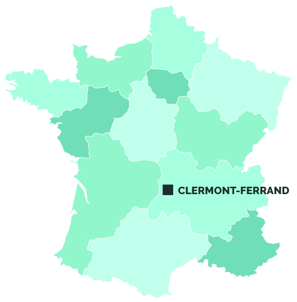

[Clermont-Ferrand](ma-ville.md) | [Puy-de-Dôme](mon-departement.md) | [Auvergne-Rhône-Alpes](ma-region.md)

---

# Ma ville, ma région

**Bienvenue** dans ce mini-site où je vais vous décrire **ma ville**, son **département** et sa **région**.

J'habite donc [Clermont-Ferrand](ma-ville.md), une ville du **centre de la France**, située dans le **Massif central** en région [Auvergne-Rhône-Alpes](ma-region.md). C'est la **capitale historique** de l'Auvergne et le **chef-lieu** du département du [Puy-de-Dôme](mon-departement.md).

📍 **_Pour le contexte, voici Clermont-Ferrand sur une carte de France :_**

---

[Clermont-Ferrand](ma-ville.md) | [Puy-de-Dôme](mon-departement.md) | [Auvergne-Rhône-Alpes](ma-region.md) | [Page d'acceuil](../Index.md)

---

Fait avec ❤️ par François