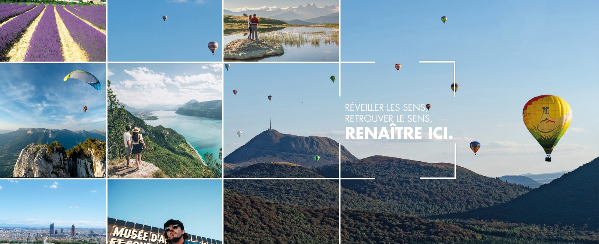
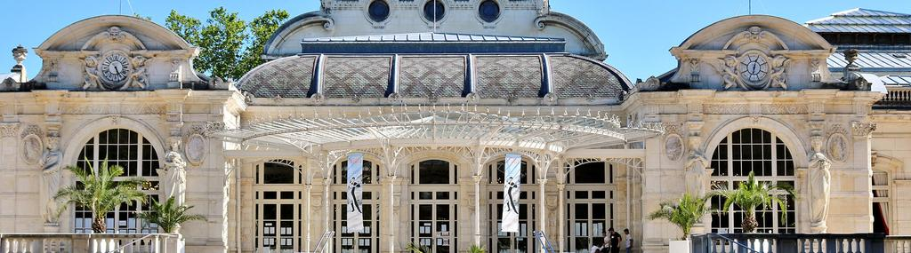
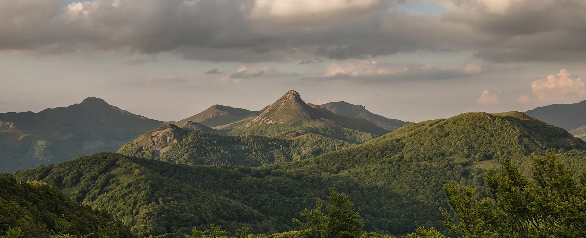
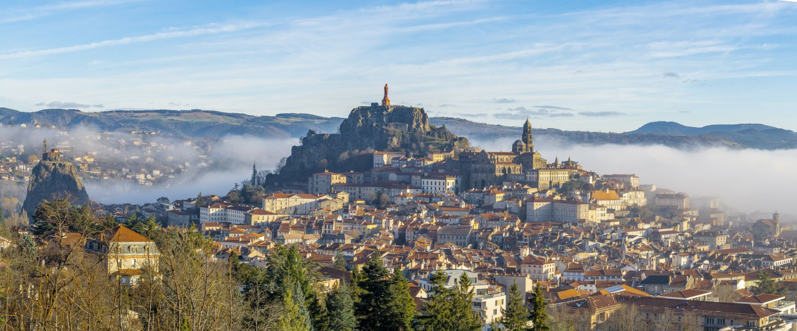
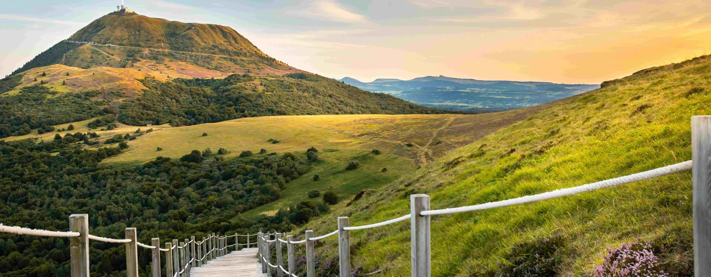
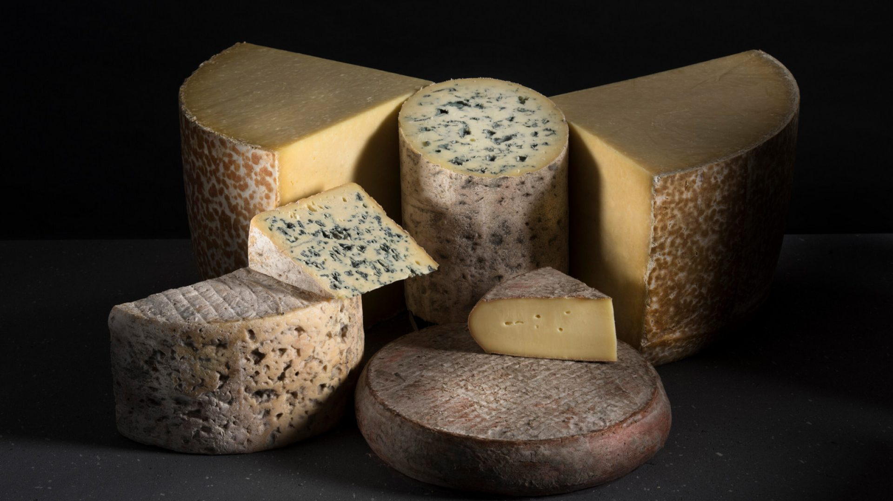

[Retour à l'accueil](index.md) | [Clermont-Ferrand](ma-ville.md) | [Puy-de-Dôme](mon-departement.md)

---

# L'Auvergne-Rhône-Alpes

La région **Auvergne-Rhône-Alpes**, c’est un sacré morceau : des volcans paisibles d’Auvergne aux sommets acérés des Alpes, en passant par la vallée du Rhône, où le vin coule presque autant que les débats sur la vraie recette de la quenelle.

On y trouve de tout :

- **Nature sauvage**,
- **Villes dynamiques** comme *Lyon*,  
- **Patrimoine historique**,  
- Et bien sûr, une **gastronomie** qui ferait pleurer un régime.  

Fromages, charcuteries, truffade, fondue, ravioles, tartiflette… il y a plus de spécialités que de virages au col de l’Iseran.

C’est une région fière, diverse, parfois un peu têtue (surtout du côté des volcans).  
Déjà qu’en Auvergne, on lançait des débats enflammés pour savoir si la truffade se fait *avec ou sans ail*, ou si le **Saint-Nectaire** vient vraiment du village du même nom…

Alors maintenant qu’on a fusionné avec les **Savoyards**, les **Lyonnais** et les autres, faire un résumé clair et simple ?

**Allez, soyons sérieux : c’est plus facile de grimper le Mont Blanc en tongs.**

---

### En plus, dans le Puy-de-Dôme, on est chauvins (et fiers de l’être)

Faut pas se mentir : pour nous, la région, c’est **d’abord et avant tout l’Auvergne**.  
Le reste, c’est sympa, hein — les Alpes, Lyon, les quenelles et tout ça — mais **le cœur**, il bat ici, entre les volcans, les burons et les plateaux balayés par le vent.

On a nos fromages qui puent (et qu’on adore), notre truffade qu’on défend bec et ongles, notre accent qui chante un peu le rugby… et un sacré caractère.  
Chez nous, le **Saint-Nectaire** est roi, le *cantou* (foyer ouvert, souvent très large, creusé dans un mur en pierre) n’a jamais été éteint, et la moindre attaque contre la potée se solde par une levée de boucliers.

Alors oui, on fait partie d’une grande région maintenant, mais **l’Auvergne ne se dissout pas dans un nom à rallonge**.  
Elle mijote, elle fume, elle vit. Et surtout, elle ne s’excuse jamais d’être un peu brute de décoffrage.  
C’est comme ça qu’on l’aime. Et qu’on s’aime.

---

### L’Allier — Le Bourbonnais, tranquille mais pas mou

Ici, c’est le pays des ducs de Bourbon.  
On y respire un air de noblesse discrète, entre forêts, rivières, bocages et vieilles pierres.  
Moulins la sage, Vichy la chic, Montluçon la populaire : l’Allier ne fait pas de bruit, mais il a tout ce qu’il faut.  

On y vit bien, on y mange bien (surtout du pâté aux pommes de terre), et on prend le temps.  
Bref, c’est la douceur de vivre version bourbonnaise.

---

### Le Cantal — Le pays où les montagnes ont du goût

Des plateaux, des burons, des vaches, du fromage (du vrai !).  
Le Cantal, c’est le département que les GPS oublient parfois, mais ceux qui y vont s’en souviennent à vie.  

Le massif cantalien, c’est une vraie claque de nature brute.  
Ici, on marche, on grimpe, on mange… et on dort bien.  
Le Cantal, c’est pas compliqué : c’est l’Auvergne dans sa forme la plus sauvage et sincère.

---

### La Haute-Loire — L’Auvergne aux accents de rivière et de volcan

Au sud-est de l’Auvergne, la Haute-Loire mêle paysages volcaniques, vallées profondes et plateaux sauvages.  
On y trouve le Mézenc, la jeune Loire qui prend sa source dans le coin, et des anciens volcans isolés qu’on appelle ici des *sucs*.  

Le Puy-en-Velay veille depuis son rocher, fière et pieuse.  
C’est une terre de pèlerins, de lentilles vertes, et de caractères bien trempés.  
Ici, l’Auvergne rime avec spiritualité… et rusticité.

---

### Le Puy-de-Dôme — Le cœur battant de l’Auvergne

Ici, c’est le centre.  
Le volcan éponyme veille sur Clermont-Ferrand, capitale auvergnate assumée (et un peu bougonne).  

Michelin, les jaunards du rugby, la chaîne des Puys ou le lac d’Aydat… tout respire l’Auvergne authentique.  
C’est un territoire fier, un peu râleur, très accueillant, et profondément attaché à ses racines volcaniques.  

Le Puy-de-Dôme, c’est l’Auvergne telle qu’on se l’imagine — et telle qu’on l’aime.

---

### Et pour finir... l'Auvergne, c'est un plateau de fromages, bien sûr !

Impossible de parler de l’Auvergne sans s’arrêter devant **le plus beau monument de la région** : son plateau de fromages.  
Ici, ce n’est pas un accompagnement, c’est une religion.  

Qu’ils soient doux, corsés, crémeux ou bleus, les fromages auvergnats racontent mieux que quiconque le caractère de cette terre : franc, généreux, un peu rude… mais authentique.

On y retrouve les **cinq AOP incontournables** :  

- **Bleu d’Auvergne**, moelleux et parfumé  
- **Fourme d’Ambert**, doux comme une caresse volcanique  
- **Cantal**, en jeune, entre-deux ou vieux selon l’humeur  
- **Salers**, rustique, au goût puissant et ferme  
- **Saint-Nectaire**, fondant, odorant, et fièrement enraciné  

En Auvergne, on ne coupe pas une tranche, **on partage un territoire**.  
Et ce territoire, il a le goût du lait cru, des caves d’affinage, et du bon pain de campagne.  

Alors servez-vous, prenez-en un morceau, et laissez fondre : vous venez de goûter à l’âme auvergnate.

---

[Retour à l'accueil](index.md) | [Clermont-Ferrand](ma-ville.md) | [Puy-de-Dôme](mon-departement.md)

---

Fait avec ❤️ par François
