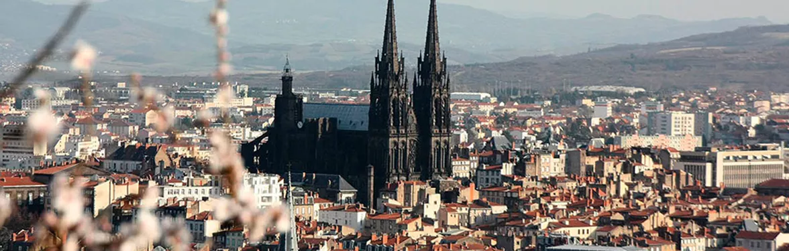
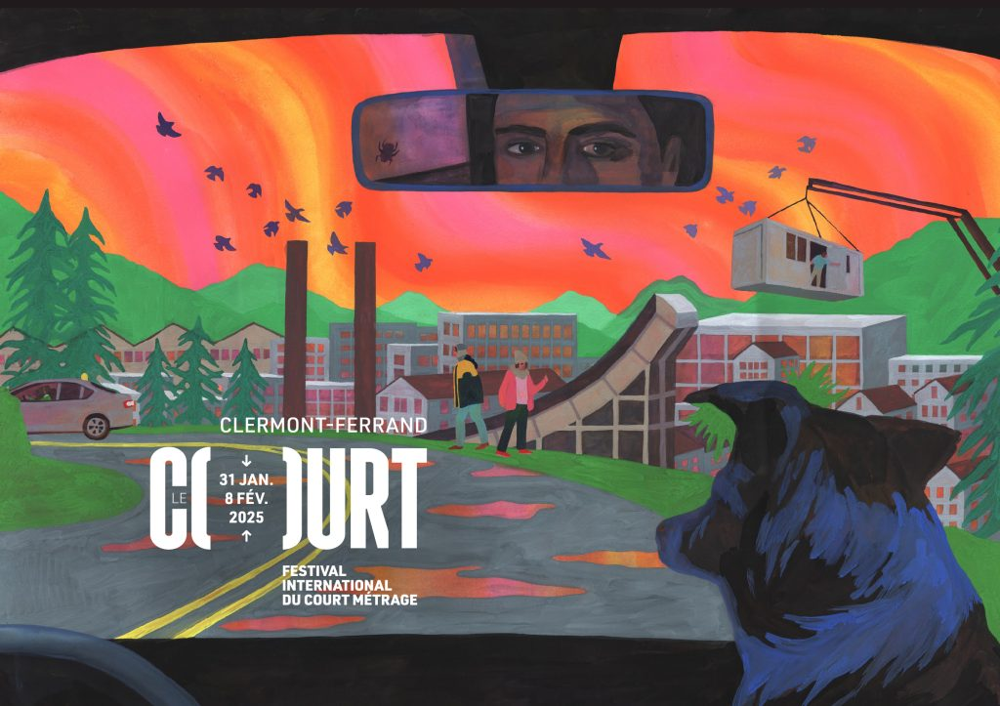
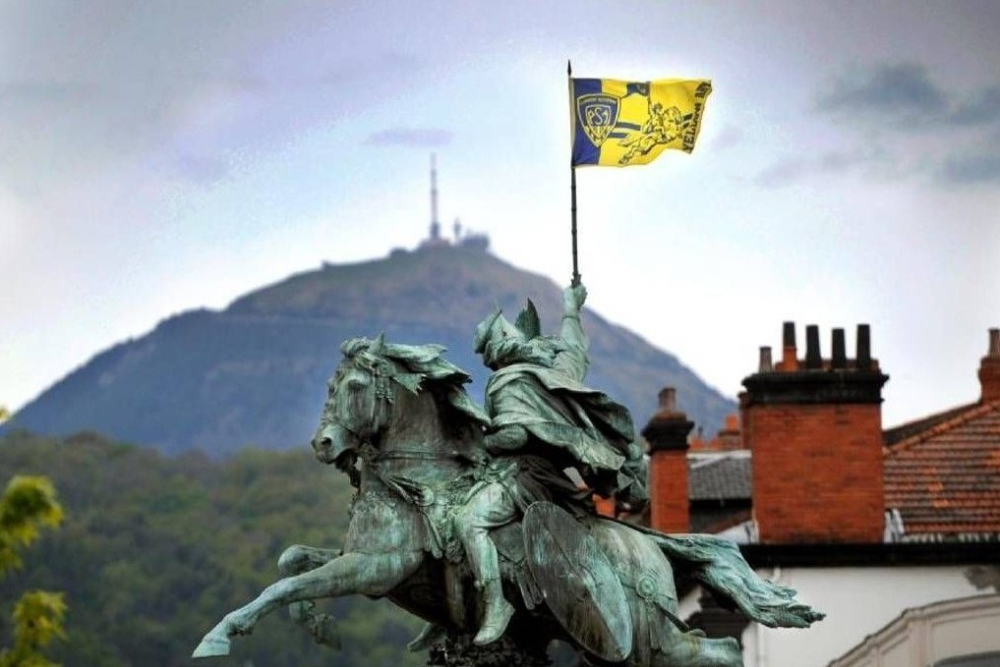

[Retour à l'accueil](index.md) | [Puy-de-Dôme](mon-departement.md) | [Auvergne-Rhône-Alpes](ma-region.md)

---

# Clermont-Ferrand

## Notre-Dame-de-l'Assomption

Comment parler de **Clermont-Ferrand** sans s'attarder sur sa **Cathédrale Notre-Dame-de-l'Assomption** ?  
Cette cathédrale gothique, construite en **pierre de lave noire** (pierre de Volvic), est un **symbole emblématique** de la ville.  
Elle est érigée au sommet de la butte centrale qui forme le **cœur historique** de Clermont-Ferrand, dominant le centre-ville et offrant une vue imprenable sur les alentours.  
Elle se trouve au carrefour des différentes rues et places de l'époque médiévale, reprenant le tracé de la ville fortifiée du IIIe siècle.

## Clermont et Montferrand

**Clermont-Ferrand**, c'est à l'origine deux villes distinctes : **Clermont** et **Montferrand**.  
Clermont, centre religieux et administratif depuis l'époque romaine, et Montferrand, fondée au XIIe siècle, connue pour son dynamisme commercial et artisanal.  
Ces deux entités ont coexisté pendant des siècles, chacune avec ses propres institutions et privilèges.  
En 1630, **Louis XIII** a décrété leur union pour simplifier l'administration et renforcer leur position économique.  
Cette fusion a marqué le début d'une nouvelle ère pour la région, combinant leurs forces pour un développement urbain et économique plus cohérent.

## Michelin

**Clermont-Ferrand** est également marquée par son lien emblématique avec **Michelin**.  
Fondée à la fin du XIXe siècle par les frères *André* et *Édouard Michelin*, l'entreprise a rapidement transformé la ville en un pôle industriel majeur.  
Michelin, mondialement connu pour ses pneumatiques, a non seulement façonné l'économie locale, mais a également influencé le développement urbain et social de la région.  
L'implantation de l'entreprise a attiré une main-d'œuvre nombreuse, stimulant ainsi la croissance démographique et économique de Clermont-Ferrand.  
Cette symbiose entre la ville et Michelin a fait de Clermont-Ferrand un symbole de l'innovation industrielle et un acteur clé dans le secteur manufacturier français.

> :bulb: ***Fait marquant :*** *Michelin, entreprise du CAC40 au rayonnement mondial, a toujours maintenu son siège social à Clermont-Ferrand, en Auvergne — un choix qui témoigne de son fort ancrage territorial et de sa fidélité à ses racines historiques.*

## Court Métrage

**Clermont-Ferrand** est le berceau d'un événement culturel majeur : le **Festival International du Court Métrage**.  
Créé en 1979, ce festival est rapidement devenu l'un des plus importants au monde dans ce domaine.  
Chaque année, il attire des cinéastes, des professionnels de l'industrie et des amateurs de cinéma du monde entier, transformant la ville en un véritable carrefour culturel.  
Le festival met en lumière des œuvres innovantes et audacieuses, offrant une plateforme unique pour les talents émergents.  
Grâce à cet événement, Clermont-Ferrand s'est imposée comme une **capitale du cinéma court**, célébrant la créativité et la diversité du septième art.

## Une Fusion Dynamique d'Études et de Culture

**Clermont-Ferrand** est une ville où l'énergie étudiante et la richesse culturelle se rencontrent.  
Grâce à des institutions comme l'**Université Clermont Auvergne**, elle attire une population jeune et dynamique, créant une atmosphère vibrante.  
Les étudiants y trouvent des formations variées et une vie culturelle animée, avec des événements divers et une scène associative active.

Au cœur de cette effervescence se trouve entre autres, le festival **Europavox**, qui célèbre la diversité musicale européenne.  
Chaque année, il attire des artistes et des mélomanes de toute l'Europe, offrant une expérience musicale unique.  
Ce festival enrichit la scène culturelle locale et renforce le statut de Clermont-Ferrand comme un lieu où culture et éducation s'entrelacent.

## ASM Clermont Auvergne et ses Supporters

Pour conclure, même si on pourrait encore trouver bien des choses à dire sur **Clermont-Ferrand**,  
comment ne pas parler de son équipe de rugby : l'**ASM Clermont Auvergne**.  
Fondé en 1911, ce club est l'un des plus renommés du championnat de France de rugby.  
Chaque année, il attire des milliers de supporters passionnés, transformant le stade **Marcel-Michelin** en une véritable fournaise.  
Les supporters de l'ASM, connus pour leur fidélité et leur ferveur, créent une atmosphère électrique lors des matchs, encourageant leur équipe avec des chants et des bannières colorées.  
Surnommés les "**Jaunards**" en raison de la couleur jaune dominante des maillots de l'équipe, ils sont également connus à l'étranger sous le nom de "**Yellow Army**" (Armée Jaune), un terme qui reflète leur soutien massif et leur passion inconditionnelle.  
Grâce à cet engouement, Clermont-Ferrand s'est imposée comme une **capitale du rugby**, célébrant l'esprit sportif et la camaraderie.

---

[Retour à l'accueil](index.md) | [Puy-de-Dôme](mon-departement.md) | [Auvergne-Rhône-Alpes](ma-region.md)

---

*Fait avec* ❤️ *par* ***François***
