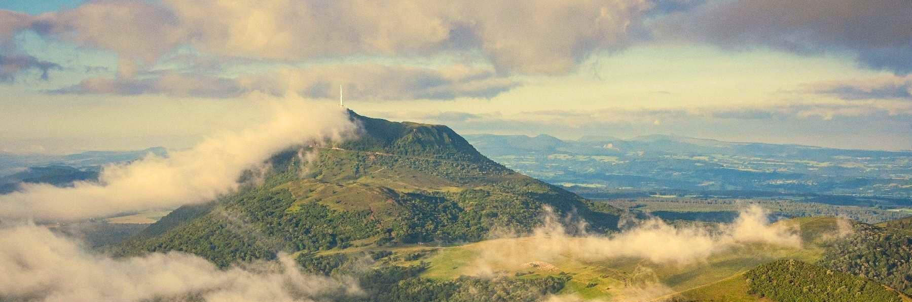
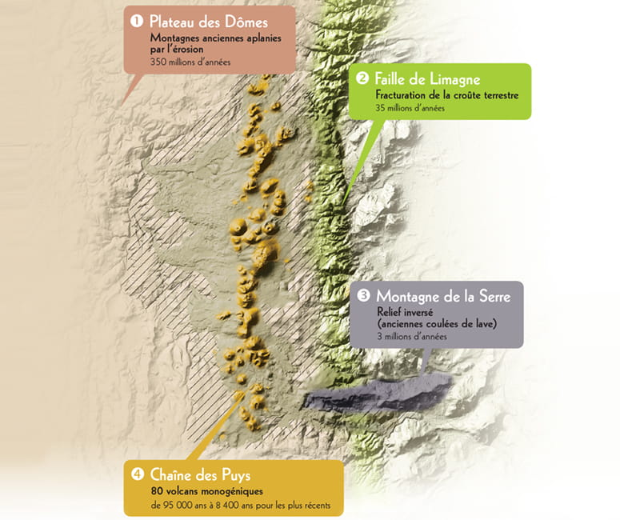
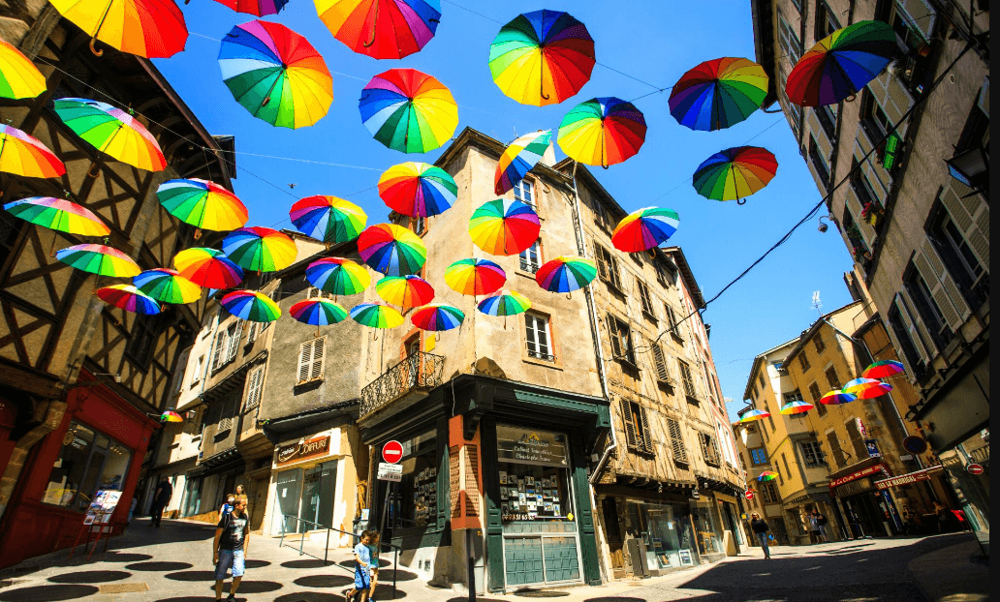
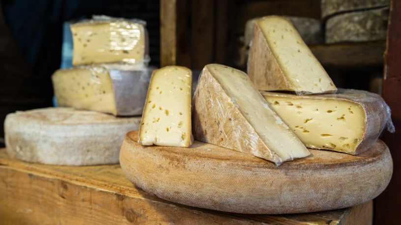

[Retour à l'accueil](index.md) | [Clermont-Ferrand](ma-ville.md) | [Auvergne-Rhône-Alpes](ma-region.md)

---

# Le Département du Puy-de-Dôme

Le *Puy de Dôme*, c’est d’abord – bien sûr – son sommet emblématique, qui porte le même nom. Bon… là, il est un peu caché, mais si vous arrivez par la route, peu importe d’où vous venez, à un moment ou un autre, vous allez forcément tomber dessus.

> **Petite parenthèse** : venez vraiment par la route. Ici, pas de TGV, pas d’aéroport international, et pour le train… disons que je vous invite à jeter un œil aux infos (souvent décourageantes) sur la ligne Paris-Clermont pour vous faire une idée.

Revenons-en au *Puy de Dôme*. Une fois en haut, le panorama vaut largement les efforts : une vue à **360°** sur la chaîne des Puys, classée à l’**UNESCO**, et par temps clair, on aperçoit même le Sancy au loin. C’est aussi un lieu chargé d’histoire, entre vestiges romains et expériences scientifiques.

C’est ici, en **1648**, que l’un des proches de Blaise Pascal, *Florin Périer*, a réalisé une expérience fondamentale : il est monté au sommet avec un baromètre pour démontrer que la pression atmosphérique diminue avec l’altitude. Une preuve, à l’époque révolutionnaire, que l’air a un poids. Aujourd’hui, un monument au sommet rend hommage à cette expérience décisive dans l’histoire des sciences. Bref, plus qu’un simple volcan, le **Puy de Dôme** est un symbole, un repère, presque une sentinelle qui veille sur toute la région.

Ce sommet mythique s’inscrit dans un ensemble plus vaste, la chaîne des Puys, un paysage volcanique exceptionnel qui fait la fierté de toute la région.

## La chaîne des Puys, un joyau volcanique inscrit au patrimoine mondial de l’UNESCO

Dominant cette chaîne de volcans, le *Puy de Dôme* en est le joyau emblématique, offrant aux visiteurs un point de vue privilégié sur ce patrimoine naturel inscrit à l’__UNESCO__. La chaîne des Puys est un ensemble unique de volcans endormis qui s’étire sur une trentaine de kilomètres au cœur de l’Auvergne. Cette chaîne volcanique, avec ses nombreux cônes, cratères et coulées de lave, témoigne d’une histoire géologique riche qui a façonné un paysage spectaculaire, à la fois sauvage et accessible.

> En **2018**, la chaîne des Puys a été inscrite au patrimoine mondial de l’UNESCO, reconnaissance de son importance exceptionnelle tant sur le plan scientifique que paysager. Ce site permet de mieux comprendre l’évolution des volcans et leurs impacts sur l’environnement.

Les sentiers de randonnée qui serpentent autour du *Puy de Dôme* et des volcans voisins offrent aux visiteurs des panoramas à couper le souffle et une immersion dans une nature préservée.

Cette inscription souligne également l’importance de préserver ce territoire unique, qui conjugue beauté naturelle, biodiversité et patrimoine culturel, faisant du Puy-de-Dôme un lieu à la fois historique et vivant, entre sciences et loisirs.

## La pierre de Volvic, roche volcanique au cœur du patrimoine local

La pierre de Volvic est une roche volcanique aux teintes sombres, façonnée il y a plusieurs millions d’années lors des éruptions de la chaîne des Puys. Facile à tailler et très résistante, elle a été largement utilisée dans la région pour construire maisons, ponts, églises ou même des éléments urbains comme les fontaines. Son aspect unique, à la fois rustique et élégant, confère à l’architecture locale un caractère bien marqué, reconnaissable entre mille.

Volvic est ainsi célèbre pour son eau minérale, puisée au cœur des volcans. L’eau de Volvic est réputée pour sa pureté et sa qualité, faisant écho au patrimoine géologique exceptionnel de la région. Ce double héritage, pierre et eau, illustre parfaitement l’harmonie entre la nature et les savoir-faire humains dans le Puy-de-Dôme.

## Thiers, capitale vivante de la coutellerie

Outre Clermont-Ferrand, dont il est souvent question, on retrouve Thiers, une autre ville emblématique du Puy-de-Dôme. Accrochée aux pentes abruptes de la vallée de la Durolle, Thiers est connue depuis le Moyen Âge pour son exceptionnel savoir-faire coutelier.

Encore aujourd’hui, des ateliers perpétuent cette tradition, mêlant techniques ancestrales et innovation. La ville conserve aussi un charme singulier avec son centre historique, ses maisons à colombages et ses ruelles escarpées.

Visiter Thiers, c’est plonger dans une histoire industrielle vivante, entre patrimoine ouvrier, artisanat d’excellence et renouveau culturel.

Chaque année, Thiers célèbre son héritage coutelier lors de **Coutellia**, le Festival international du couteau d'art et de tradition. En **2025**, la 34e édition se tiendra les **17 et 18 mai**, rassemblant plus de **300 exposants** venus de **23 pays**. Cet événement, l'un des plus importants au monde dans le domaine, propose des démonstrations, des concours et des expositions mettant en lumière le savoir-faire ancestral et l'innovation des artisans couteliers.

## La gastronomie du Puy-de-Dôme : un terroir riche en saveurs

Le Puy-de-Dôme est réputé pour ses produits du terroir authentiques et savoureux. Parmi eux, le **Saint-Nectaire** tient une place particulière. Ce fromage à pâte pressée non cuite, à la croûte fleurie et à la saveur douce et fruitée, bénéficie d’une appellation d’origine protégée (*AOP*) depuis **1955**.

Il est produit exclusivement dans le département, sur des prairies volcaniques qui donnent toute sa richesse au lait utilisé. Le Saint-Nectaire se déguste aussi bien sur un plateau que fondu dans diverses recettes locales, et il incarne parfaitement l’identité gastronomique du Puy-de-Dôme.

## Conclusion

En résumé, le Puy-de-Dôme est une terre riche en paysages volcaniques majestueux, en patrimoine vivant comme la coutellerie de Thiers, et en ressources naturelles emblématiques telles que la pierre et l’eau de Volvic.

Sans oublier une gastronomie authentique avec des produits d’exception comme le Saint-Nectaire.

C’est aussi un terrain de jeu idéal pour les amateurs de randonnée, avec des sentiers qui permettent de s’immerger pleinement dans cette nature préservée et ses panoramas à couper le souffle.

> Il serait toutefois impossible de tout évoquer ici : le département recèle bien d’autres trésors — comme la vallée des Saints, les gorges de la Sioule, le plateau de Gergovie ou encore le lac Chambon… — autant d’invitations à prolonger la découverte par vous-même.

Ce portrait n’est qu’un premier pas vers une région aux multiples facettes, à la fois historique et vivante.

---

[Retour à l'accueil](index.md) | [Clermont-Ferrand](ma-ville.md) | [Auvergne-Rhône-Alpes](ma-region.md)

---

Fait avec ❤️ par François
