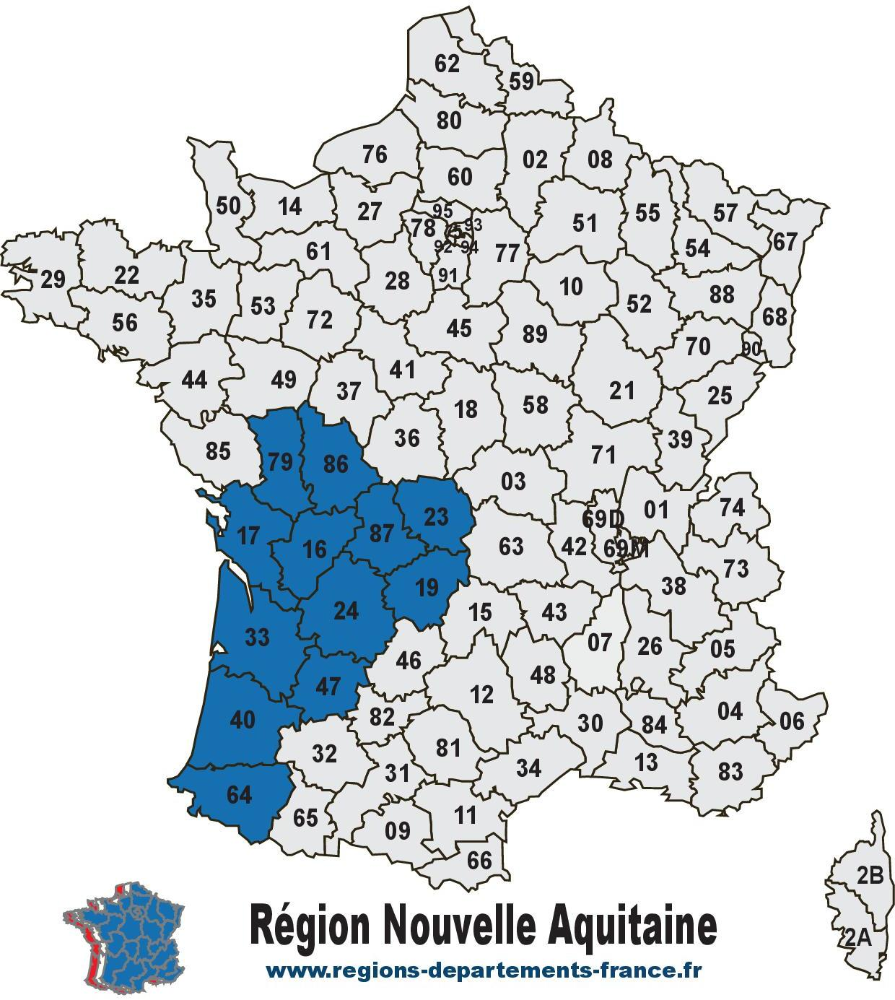
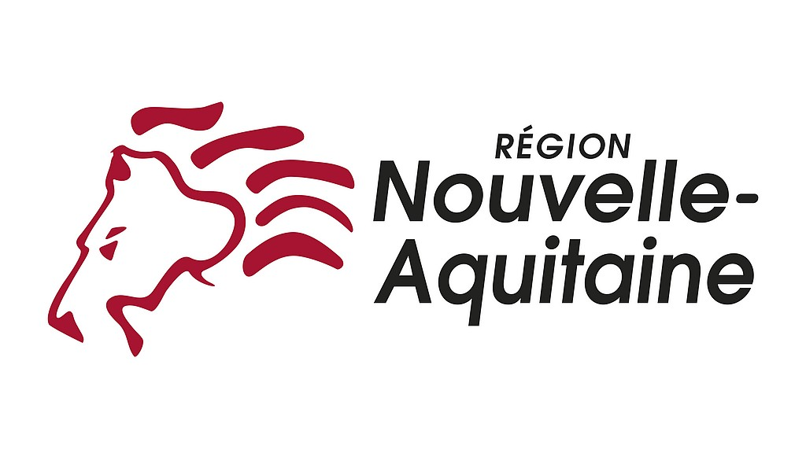

# La Nouvelle-Aquitaine

Cap sur la Nouvelle-Aquitaine ! Entre océan, vignes, montagnes et villages de caractère, cette région XXL vous embarque dans un voyage où nature, culture et innovation s’entremêlent avec passion.

---

### 🌍 Présentation générale

<u>Superficie</u> : 84 036 km² (la plus grande région de France métropolitaine)

<u>Population</u> : Environ 6 millions d'habitants

<u>Préfecture</u> : Bordeaux

<u>Départements</u> : 12 

|Départements| Numéro|
|:----|:----|
|Charente| 16|
|Charente-Maritime| 17|
|Corrèze| 19|
|Creuse| 23|
|Dordogne| 24|
|Gironde| 33|
|Landes| 40|
|Lot-et-Garonne| 47|
|Pyrénées-Atlantique| 64|
|Deux-Sèvres| 79|
|Vienne| 86|
|Haute-Vienne| 87|

---

### 🏞️ Géographie et nature

La **Nouvelle-Aquitaine** s'étend de l'océan Atlantique aux montagnes des Pyrénées, en passant par des vallées fertiles, des plateaux et des forêts. Quelques lieux emblématiques:

- **La Dune du *Pilat*** (plus haute dune d’Europe)

- **Le Marais poitevin** (aussi appelé la Venise verte)

- **Le Périgord**(grottes de Lascaux, vallée de la Dordogne)

- **Les Pyrénées béarnaises** et **basques** (rando, ski, thermalisme).

---

### 🍇 Vins et gastronomie

La région est mondialement connue pour ses produits gastronomiques:

1. <u>**Vins**</u> : Bordeaux, Saint-Émilion, Pomerol, Bergerac, Jurançon, etc.

2. <u>**Spécialités culinaires**</u> : foie gras, magret de canard, truffes, huîtres de Marennes-Oléron, fromage de brebis, piment d’Espelette, noix du Périgord...

---

### 🏛️ Patrimoine et culture

La **Nouvelle-Aquitaine** est riche en histoire, architecture et traditions.

Il y a de nombreuse villes historiques comme Bordeaux (classée UNESCO), Poitiers, Limoges, La Rochelle, Bayonne, Périgueux...

Aussi, il est possible de visiter des Châteaux et bastides comme Monpazier, Beynac, château de Bonaguil et bien d'autres.

Il y a également des sites préhistoriques à visiter : Lascaux, grotte de Rouffignac...

Vous pourez aussi vous immerger au sein des cultures basque et occitane (langues, fêtes traditionnelles, sport : pelote basque, rugby).

---

### 🏖️ Tourisme et loisirs

- **Sur le littoral atlantique** : plages de surf à Hossegor, Biarritz, Cap Ferret, île de Ré...

- **Les stations thermales** : Dax, Bagnères-de-Bigorre, Eugénie-les-Bains

- **Activités de plein air** : randonnée, vélo, kayak, ski dans les Pyrénées

Vous pouvez en découvrir plus encore sur cette maginfique région qu'est la Nouvelle-Aquitaine [juste ici.](https://www.nouvelle-aquitaine-tourisme.com/fr)

Voici le lien pour retourner vers [la page d'acceuil](index.md). Tu pourras te diriger vers d'autres pages qui te donneront des informations sur la ville de [La Rochelle](ma-ville.md) et sur la département de la [Charente-Maritime](mon-département.md).