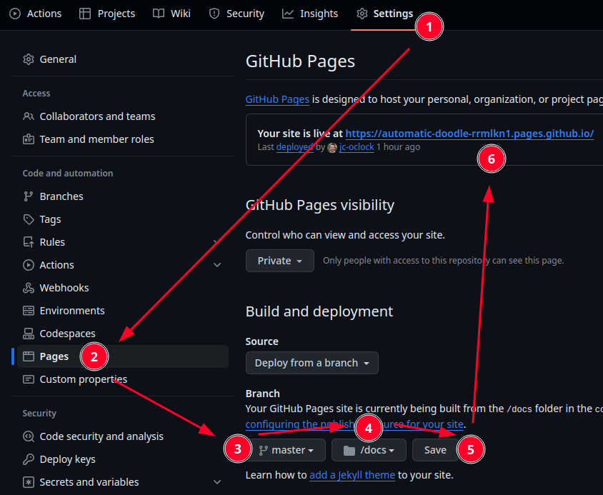
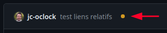
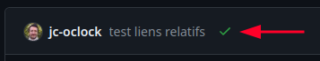

# Mettre en ligne un site Web via GitHub Pages

## Objectifs

Pour mettre en ligne nos documents comme des pages Web, nous allons suivre ces étapes : 

- Activer GitHub Pages sur le dossier `docs`
- configurer un thème fourni par GitHub Pages
- tester :tada:

### 1. Activer GitHub Pages

Sur votre dépôt, allez dans *Settings* et suivez ce guide : 



Cela indique à GitHub que vous souhaitez délivrer un site Web qui sera hébergé dans le dossier `docs` de votre branche `master`. Après l'étape 5, **vous aurez accès à une URL (une adresse Web) pour vous rendre sur le site (étape 6)**

> [!WARNING]
> **La première fois** que vous appuyez sur *Save*, **pensez à rafraichir la page** pour que l'URL du site s'affiche (étape 6). Si tout s'est bien passé, votre site est en ligne :tada:

#### Actions en attente

:warning: Par la suite, quand vous ferez des modifications dans vos fichiers, à chaque fois que vous *pousserez* votre code (`git push`), GitHub va exécuter une suite de commandes en arrière-plan pour convertir vos Markdown en HTML. Cette étape prend en général entre 15s et 45s.

Sur la page de votre dépôt GitHub, 

En attente (si cela prend trop de temps, rechargez la page pour voir si ça évolue).  


Terminé !  


À ce moment-là vous pouvez utiliser l'URL fournie précédemment.

Si vous avez une erreur, il faudra creuser pour voir d'où elle provient et tenter de corriger.

### 2. Configurer un thème fourni par GitHub Pages

Les pages qui ont été générées sont assez brutes au niveau design, on va pouvoir utiliser un thème graphique parmi les thèmes proposées par GitHub Pages.

Nous allons utiliser le thème _Dinky_.

[La documentation est ici](https://github.com/pages-themes/dinky?tab=readme-ov-file), mais nous allons vous guider car elle n'est pas des plus simples à lire.

Vous allez créer un nouveau fichier `_config.yml` *dans* le dossier `docs/` avec les informations suivantes : 

```yaml
# le titre du site
title: Ma ville, ma région !
# la description du site
description: Tout ce que vous avez toujours voulu savoir sur ma ville et ma région sans savoir jamais osé le demander.
# le thème graphique GitHub à utiliser
remote_theme: pages-themes/dinky@v0.2.0
# cette option est nécessaire pour que GitHub utilise les thèmes
plugins:
  - jekyll-remote-theme
```

Vous pouvez choisir un nouveau thème [depuis cette page](https://pages.github.com/themes/).

Les thèmes datent un peu (environ 8 ans) mais ce n'est pas un problème, l'idée c'est surtout de comprendre que GitHub peut transformer nos fichiers Markdown en HTML et même y appliquer une mise en forme.

Vous pouvez aller plus loin en suivant la rubrique _Layouts_ de la doc, mais ce serait anticiper sur la prochaine semaine HTML/CSS qui arrive à grand pas !

À ce stade vous pouvez déjà observer le code HTML de la page, en faisant _Bouton droit > Code source de la page_ (sur la page) ou avec le raccourci clavier `Ctrl+U`. Si vous êtes novice en HTML, cela vous donnera une idée de ce qui nous attend la semaine prochaine :wink:
