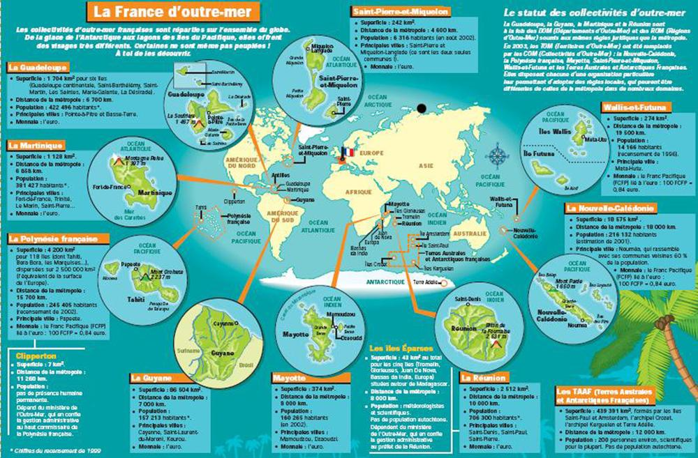
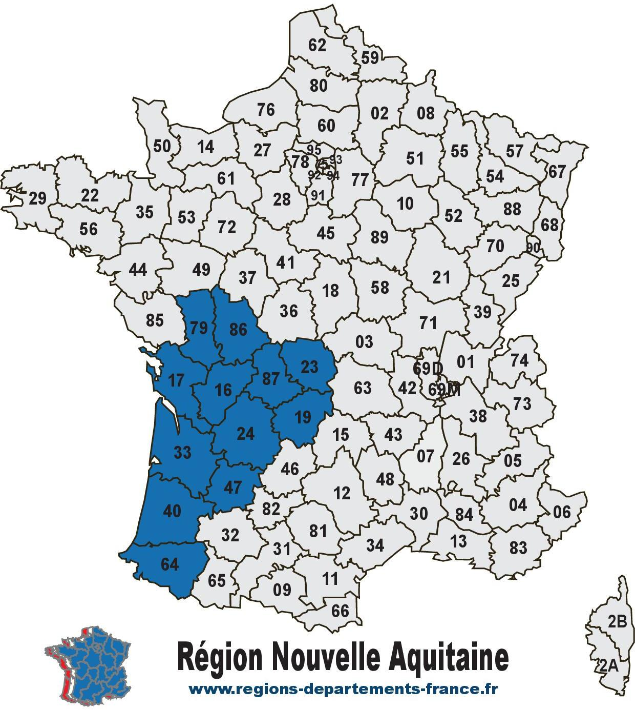

# Bienvenue dans les Outre-mer français ! 🌴🌊

Saviez-vous que la France ne se limite pas à l’Europe ?  
En réalité, elle est présente un peu partout sur la planète, grâce à ses territoires d’Outre-mer. Et croyez-moi, ces endroits valent le détour !

Les Outre-mer regroupent plusieurs **îles et régions éloignées**, situées aux quatre coins du monde :
- dans les **Caraïbes**, avec la Guadeloupe et la Martinique,
- dans l’**océan Indien**, comme La Réunion ou Mayotte,
- en **Amérique du Sud**, avec la Guyane,
- dans le **Pacifique**, avec la Polynésie française, la Nouvelle-Calédonie ou encore Wallis-et-Futuna,
- et même jusqu’aux **terres australes**, proches de l’Antarctique.

Chacun de ces territoires a ses **paysages incroyables** : plages paradisiaques, volcans, forêts tropicales, récifs coralliens... Un vrai tour du monde sans quitter la France !

Mais les Outre-mer, ce n’est pas que la nature. C’est aussi une **culture riche et colorée** : des musiques rythmées, une cuisine pleine de saveurs, des traditions vivantes et des habitants accueillants. Chaque territoire a son histoire, son identité, mais tous font partie de notre pays.

Grâce à eux, la France est **présente dans tous les océans**, et possède l’un des plus grands espaces maritimes au monde. Ces régions sont précieuses pour la biodiversité, la science, la défense, et bien sûr, pour leur beauté.

---

## 🌍 Un aperçu en image

---

En résumé : les Outre-mer, c’est un peu de France... sous les tropiques, dans la jungle, sur les îles ou même aux confins du monde.  
Et tout ça fait partie de notre richesse 🇫🇷

---

[⬅️ Retour à l'accueil](index.md)
=======
# La Nouvelle-Aquitaine

Cap sur la Nouvelle-Aquitaine ! Entre océan, vignes, montagnes et villages de caractère, cette région XXL vous embarque dans un voyage où nature, culture et innovation s’entremêlent avec passion.

---

### 🌍 Présentation générale

<u>Superficie</u> : 84 036 km² (la plus grande région de France métropolitaine)

<u>Population</u> : Environ 6 millions d'habitants

<u>Préfecture</u> : Bordeaux

<u>Départements</u> : 12 

|Départements| Numéro|
|:----|:----|
|Charente| 16|
|Charente-Maritime| 17|
|Corrèze| 19|
|Creuse| 23|
|Dordogne| 24|
|Gironde| 33|
|Landes| 40|
|Lot-et-Garonne| 47|
|Pyrénées-Atlantique| 64|
|Deux-Sèvres| 79|
|Vienne| 86|
|Haute-Vienne| 87|

---

### 🏞️ Géographie et nature

La **Nouvelle-Aquitaine** s'étend de l'océan Atlantique aux montagnes des Pyrénées, en passant par des vallées fertiles, des plateaux et des forêts. Quelques lieux emblématiques:

- **La Dune du *Pilat*** (plus haute dune d’Europe)

- **Le Marais poitevin** (aussi appelé la Venise verte)

- **Le Périgord**(grottes de Lascaux, vallée de la Dordogne)

- **Les Pyrénées béarnaises** et **basques** (rando, ski, thermalisme).

---

### 🍇 Vins et gastronomie

La région est mondialement connue pour ses produits gastronomiques:

1. <u>**Vins**</u> : Bordeaux, Saint-Émilion, Pomerol, Bergerac, Jurançon, etc.

2. <u>**Spécialités culinaires**</u> : foie gras, magret de canard, truffes, huîtres de Marennes-Oléron, fromage de brebis, piment d’Espelette, noix du Périgord...

---

### 🏛️ Patrimoine et culture

La **Nouvelle-Aquitaine** est riche en histoire, architecture et traditions.

Il y a de nombreuse villes historiques comme Bordeaux (classée UNESCO), Poitiers, Limoges, La Rochelle, Bayonne, Périgueux...

Aussi, il est possible de visiter des Châteaux et bastides comme Monpazier, Beynac, château de Bonaguil et bien d'autres.

Il y a également des sites préhistoriques à visiter : Lascaux, grotte de Rouffignac...

Vous pourez aussi vous immerger au sein des cultures basque et occitane (langues, fêtes traditionnelles, sport : pelote basque, rugby).

---

### 🏖️ Tourisme et loisirs

- **Sur le littoral atlantique** : plages de surf à Hossegor, Biarritz, Cap Ferret, île de Ré...

- **Les stations thermales** : Dax, Bagnères-de-Bigorre, Eugénie-les-Bains

- **Activités de plein air** : randonnée, vélo, kayak, ski dans les Pyrénées

Vous pouvez en découvrir plus encore sur cette maginfique région qu'est la Nouvelle-Aquitaine [juste ici.](https://www.nouvelle-aquitaine-tourisme.com/fr)

Voici le lien pour retourner vers [la page d'acceuil](index.md). Tu pourras te diriger vers d'autres pages qui te donneront des informations sur la ville de [La Rochelle](ma-ville.md) et sur la département de la [Charente-Maritime](mon-département.md).

