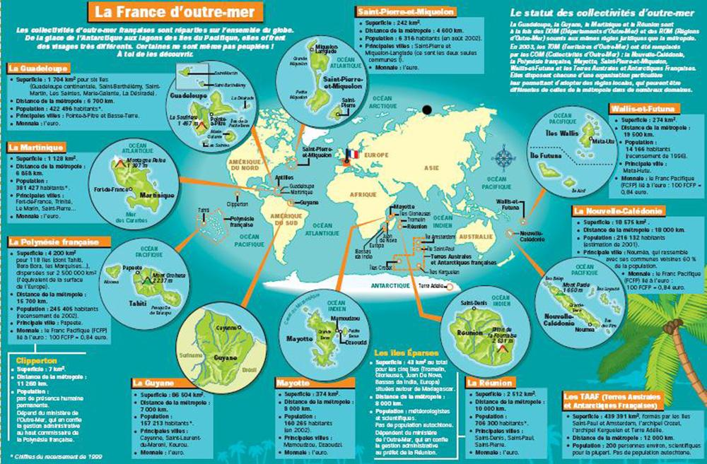

# Bienvenue dans les Outre-mer français ! 🌴🌊

Saviez-vous que la France ne se limite pas à l’Europe ?  
En réalité, elle est présente un peu partout sur la planète, grâce à ses territoires d’Outre-mer. Et croyez-moi, ces endroits valent le détour !

Les Outre-mer regroupent plusieurs **îles et régions éloignées**, situées aux quatre coins du monde :
- dans les **Caraïbes**, avec la Guadeloupe et la Martinique,
- dans l’**océan Indien**, comme La Réunion ou Mayotte,
- en **Amérique du Sud**, avec la Guyane,
- dans le **Pacifique**, avec la Polynésie française, la Nouvelle-Calédonie ou encore Wallis-et-Futuna,
- et même jusqu’aux **terres australes**, proches de l’Antarctique.

Chacun de ces territoires a ses **paysages incroyables** : plages paradisiaques, volcans, forêts tropicales, récifs coralliens... Un vrai tour du monde sans quitter la France !

Mais les Outre-mer, ce n’est pas que la nature. C’est aussi une **culture riche et colorée** : des musiques rythmées, une cuisine pleine de saveurs, des traditions vivantes et des habitants accueillants. Chaque territoire a son histoire, son identité, mais tous font partie de notre pays.

Grâce à eux, la France est **présente dans tous les océans**, et possède l’un des plus grands espaces maritimes au monde. Ces régions sont précieuses pour la biodiversité, la science, la défense, et bien sûr, pour leur beauté.

---

## 🌍 Un aperçu en image

---

En résumé : les Outre-mer, c’est un peu de France... sous les tropiques, dans la jungle, sur les îles ou même aux confins du monde.  
Et tout ça fait partie de notre richesse 🇫🇷

---

[⬅️ Retour à l'accueil](index.md)
