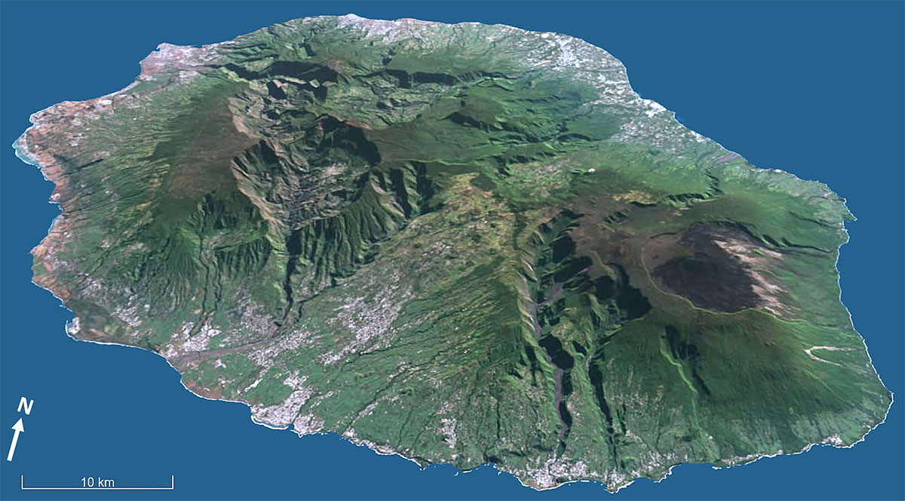
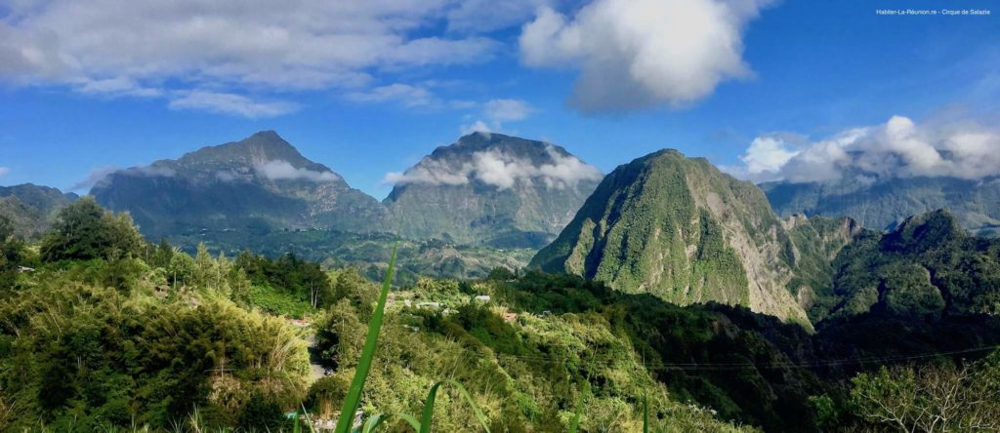
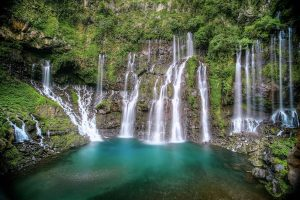

# Mon département : La Réunion, là où battent mes racines ❤️🌋

Bienvenue sur cette page un peu spéciale pour moi.  
Aujourd’hui, je ne vous présente pas juste un lieu… je vous parle d’un **morceau de moi-même** : **l’île de La Réunion**.

Située dans l’océan Indien, à plus de 9 000 kilomètres de la métropole, La Réunion est un **département français d’Outre-mer**. Officiellement française, profondément créole, incroyablement riche, **elle représente à mes yeux bien plus qu’une destination exotique ou une carte postale**.

---

## 🌱 Une île qui fait partie de moi

La Réunion, c’est **mon héritage, mes racines, ma famille**.  
J’y ai de la famille très proche, et c’est à travers elle que j’ai appris à connaître cette île, à l’aimer, à la ressentir.  
Même si je n’y vis pas à l’année, chaque visite est une reconnexion intense, comme si mon cœur retrouvait un rythme naturel dès que j’y pose les pieds.

C’est un lieu qui m’appelle, qui me parle, qui me ressource.  
C’est **chez moi**, même à des milliers de kilomètres.

---

## 🌋 Une terre de contrastes, de puissance et de douceur

Imaginez un lieu où vous pouvez admirer le lever du soleil depuis un volcan actif, marcher dans une forêt tropicale l’après-midi, puis terminer la journée sur une plage de sable noir ou blond.  
Bienvenue à La Réunion.

L’île est **spectaculaire** :  
- Le **Piton de la Fournaise**, l’un des volcans les plus actifs au monde, fascine autant qu’il impressionne.
- Les **cirques naturels** de Cilaos, Salazie et Mafate offrent des panoramas à couper le souffle et abritent des villages inaccessibles par la route, où le temps semble suspendu.  
- Les **plages** bordent un lagon protégé par une barrière de corail, parfait pour se détendre ou plonger parmi les poissons tropicaux.

Mais La Réunion, c’est aussi **des traditions bien vivantes**, des marchés remplis d’épices, des musiques comme le maloya ou le séga, et une **culture créole unique**, née du mélange de plusieurs peuples venus d’Afrique, d’Inde, de Chine, de Madagascar et d’Europe.

---

## 🤝 Une île de valeurs et d’humanité

Ce que j’admire autant que ses paysages, c’est **l’état d’esprit réunionnais**.  
Les gens y sont chaleureux, accueillants, simples, généreux. On y partage, on y sourit, on y aide sans réfléchir. Il y a quelque chose d’authentique et de fort dans la manière dont les Réunionnais vivent ensemble, malgré la diversité des origines et des croyances.

C’est une terre de **respect**, de **tolérance** et de **cohabitation**.  
Et dans le monde d’aujourd’hui, c’est une vraie richesse.

---

## 📸 Quelques images pour rêver un peu...

---

## 📝 En résumé...

Si je devais résumer ce que représente La Réunion pour moi, je dirais :  
➡️ **Un lien du cœur**  
➡️ **Une fierté personnelle**  
➡️ **Un endroit qui me construit, même à distance**

Je vous invite sincèrement à la découvrir un jour par vous-même. Pas seulement comme touriste, mais en la regardant avec attention, en la vivant, en l’écoutant. Vous verrez, **elle a beaucoup à offrir.**

Merci d’avoir pris le temps de lire ces mots.  
Et maintenant, vous comprenez sûrement un peu mieux pourquoi **La Réunion, c’est plus qu’un département : c’est une part de moi.**

---
Si le coeur vous en dit voici un lien vers une emission qui la présente en profondeur:

https://www.youtube.com/watch?v=rXMucMTPBGo

---
[⬅️ Retour à l'accueil](index.md)
